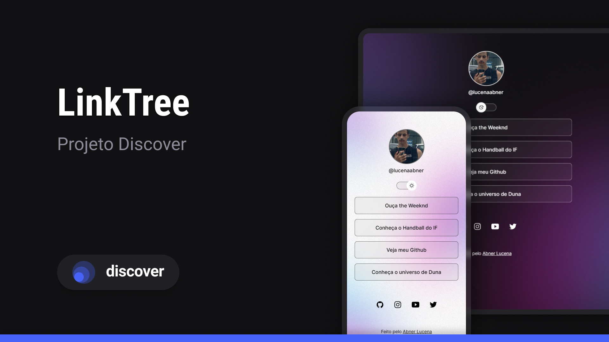

<h1 align="center"> Linktree </h1>

Este programa foi feito com o auxílio do curso Discover, promovido pela Rocketseat. Além de algumas alterações autorais feitas por mim em cima do projeto original.  
<a href="https://app.rocketseat.com.br/journey/discover/contents">Dê uma olhada no curso Discover</a>

  <a href="#-tecnologias">Tecnologias</a>&nbsp;&nbsp;&nbsp;|&nbsp;&nbsp;&nbsp;
  <a href="#-projeto">Projeto</a>&nbsp;&nbsp;&nbsp;|&nbsp;&nbsp;&nbsp;
  <a href="#-layout">Layout</a>&nbsp;&nbsp;&nbsp;|&nbsp;&nbsp;&nbsp;
  <a href="#memo-licença">Licença</a>

  

 

  

## 🚀 Tecnologias

Esse projeto foi desenvolvido com as seguintes tecnologias:

- HTML e CSS
- JavaScript
- Git e Github
- Figma Professional

## 💻 Projeto

O DevLinks é um agregador de links para usar como cartão de visitas online.

- [Acesse o projeto finalizado, online (Em breve)](/maykbrito)

## 🔖 Layout

Você pode visualizar o layout do projeto original através [DESSE LINK](https://www.figma.com/community/file/1187422022288947321). É necessário ter conta no [Figma](https://figma.com) para acessá-lo.

##  Licença

Esse projeto está sob a licença MIT.

---

Feito com ♥ pelo Abner Lucena [Me segue la no insta!](https://www.instagram.com/lucenaabner/)
